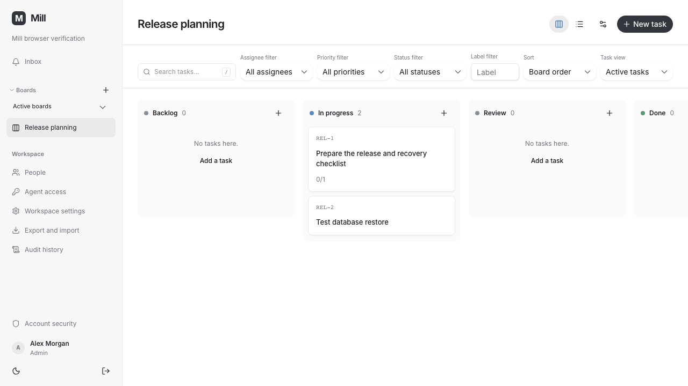

# Mill

Mill is a self-hosted task board for people and external agents, created by Avgeek, Inc. It runs one web/API service and PostgreSQL. You own the data; everyday task management needs no LLM key or paid service.

Create boards, organize their statuses, and work in Kanban or list view. Tasks have stable identifiers, Markdown descriptions, assignments, labels, priorities, due dates, checklists, comments, and activity. Team members use Admin, Member, or Viewer access. External agents use revocable credentials or OAuth and the same permission checks through REST and MCP.

The repository remains private during B1 review. The proposed release is `v1.0.0-beta.1`. Check [B1 verification](docs/b1-verification.md) for observed evidence and remaining gaps; this README does not establish release readiness.



## Install locally

Install Docker with Compose v2, Git, and Node.js 24. Clone the repository into a directory you control, then run:

```sh
git clone https://github.com/avgeek-inc/mill.git
cd mill
node tools/init-env.mjs
docker compose --project-name mill --env-file .env up --build --detach --wait
```

Open [localhost:4321](http://localhost:4321), create your workspace and first administrator, and [make your first board](docs/getting-started.md). The setup form is available only until the first administrator exists. Mill has no default account or password.

The generated `.env` contains private keys and the database password. Keep it out of Git and save an encrypted copy with your database backups. Stop the services with `docker compose --project-name mill --env-file .env down`. Data stays in the project volume unless you explicitly remove it.

For remote access, configure an HTTPS reverse proxy and use [the production installation guide](docs/installation.md). Do not expose the local HTTP installation on the internet.

## Develop

The toolchain is Node.js 24.16.0 and pnpm 11.5.3. All packages are available from public registries; there is no dependency on another Avgeek checkout.

```sh
npm install --global pnpm@11.5.3
pnpm install --frozen-lockfile
node tools/init-env.mjs
docker compose --project-name mill --env-file .env --file docker-compose.yml --file tools/compose-development.yml up --detach --wait postgres
pnpm migrate
MILL_BASE_URL=http://localhost:4322 pnpm dev
```

Run `pnpm dev:web` in a second terminal for the frontend development server at [localhost:4322](http://localhost:4322). The frontend proxies API requests to port 4321. The `MILL_BASE_URL` override above lets the API trust browser requests from the development frontend. If `.env` already exists, keep it and skip `init-env`. See [contributing](CONTRIBUTING.md) for database-backed verification and browser tests.

## Documentation

- [Installation](docs/installation.md), [configuration](docs/configuration.md), and [first board](docs/getting-started.md)
- [Team, tasks, and permissions](docs/workflows.md)
- [REST API and MCP](docs/agents.md)
- [Operations](docs/operations.md), [backup and recovery](docs/backup.md), and [upgrades](docs/upgrades.md)
- [Troubleshooting](docs/troubleshooting.md) and [B1 release notes](docs/release-notes.md)
- [Contributing](CONTRIBUTING.md), [security reports](SECURITY.md), and [code of conduct](CODE_OF_CONDUCT.md)

## License

Mill uses the [Apache License 2.0](LICENSE). [NOTICE](NOTICE) records adapted code and third-party attribution. The current UI uses open-source components, fonts, and icons.
