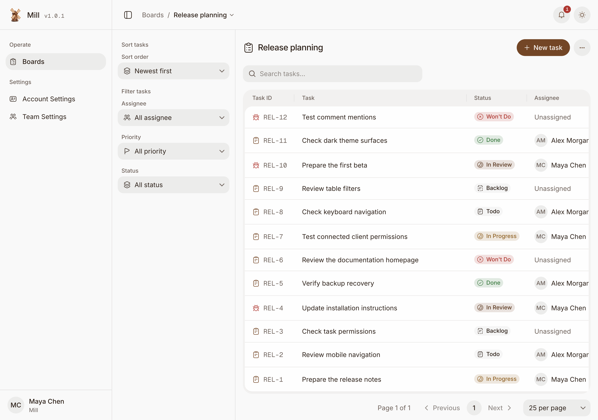

# Mill

Mill is a self-hosted task list for teams, created by Avgeek, Inc. It runs one web/API service and PostgreSQL. You own the data; everyday task management needs no LLM key or paid service.

Create boards and work in a task list with six fixed statuses: Backlog, Todo, In Progress, In Review, Done, and Won't Do. Boards appear alphabetically. Tasks have Task or Bug types, stable identifiers, Markdown descriptions, optional assignees, priorities, start and due dates, comments, and activity. Team members use Admin, Member, or Viewer access.

Personal and team API keys have explicit Read-only, Edit, or Administrative permissions for REST and MCP. Personal keys remain bounded by their owner's active membership and current role; administrators issue team keys against the team policy. MCP clients can also connect through OAuth with approved read/write scopes and optional board limits.



The proposed release is `v1.0.1`. See the [release verification checklist](docs/publishing-checklist.md) for maintainer requirements. Use a published release and its image manifest for an installation; a proposed tag is not a published image.

The release publisher produces the combined web/API image at `ghcr.io/avgeek-oss/mill`. It runs for an existing stable tag on current `main`, verifies exact-commit CI, and publishes a GitHub release after native AMD64 and ARM64 installation checks pass. The release asset `mill-images.json` records the immutable image digest. See [installation](docs/installation.md) for the public, digest-pinned image path.

## Install locally

Install Docker with Compose v2, Git, Node.js 24, `curl`, and `jq`. Choose a tag that has a published GitHub release, then run:

```sh
git clone https://github.com/avgeek-oss/mill.git
cd mill
release_tag=v1.0.1 # replace with the published release tag
git checkout "$release_tag"
curl --fail --location --output mill-images.json "https://github.com/avgeek-oss/mill/releases/download/$release_tag/mill-images.json"
test "$(jq -r .version mill-images.json)" = "$release_tag"
test "$(jq -r .commit mill-images.json)" = "$(git rev-parse HEAD)"
image="$(jq -r .image mill-images.json)"
node tools/init-env.mjs --image "$image"
docker compose --project-name mill --env-file .env pull mill
docker compose --project-name mill --env-file .env up --no-build --detach --wait
```

Open [localhost:4321](http://localhost:4321), create your workspace and first administrator, and [make your first board](docs/getting-started.md). The setup form is available only until the first administrator exists. Mill has no default account or password.

The published image needs no package-registry credentials or source build. To build from source, follow [package registry setup](docs/package-registry.md). GitHub Packages authentication is required for public npm packages used by contributors.

The generated `.env` contains private keys and the database password. Keep it out of Git and save an encrypted copy with your database backups. Stop the services with `docker compose --project-name mill --env-file .env down`. Data stays in the project volume unless you explicitly remove it.

For remote access, generate `.env` with `--base-url` set to your HTTPS origin and configure a reverse proxy as shown in [installation](docs/installation.md). Do not expose the local HTTP installation on the internet.

## Develop

The toolchain is Node.js 24.16.0 and pnpm 11.5.3. Dependencies are open source and available from npm or GitHub Packages; there is no dependency on another Avgeek checkout. Authenticate to GitHub Packages as described above before installing.

```sh
npm install --global pnpm@11.5.3
node tools/with-package-token.mjs pnpm install --frozen-lockfile
node tools/init-env.mjs
docker compose --project-name mill --env-file .env --file docker-compose.yml --file tools/compose-development.yml up --detach --wait postgres
pnpm migrate
MILL_BASE_URL=http://localhost:4322 pnpm dev
```

Run `pnpm dev:web` in a second terminal for the frontend development server at [localhost:4322](http://localhost:4322). The frontend proxies API requests to port 4321. The `MILL_BASE_URL` override above lets the API trust browser requests from the development frontend. If `.env` already exists, keep it and skip `init-env`.

Run `pnpm test:quick` for fast Node checks of frontend helpers, configuration and date formatting. See [contributing](CONTRIBUTING.md) for the complete `pnpm verify` and `pnpm verify:production` gates and manual UI review. CI requires the `verify` and `production` gates.

Run `pnpm docs:dev` to preview the documentation from the repository's `docs` root.

## Documentation

Read the [Mill website and documentation](https://www.mill.fyi) or use the guides in this repository.

- [Overview](docs/overview.md), [installation](docs/installation.md), [configuration](docs/configuration.md), and [first board](docs/getting-started.md)
- [Task lists and filters](docs/task-lists.md), [task details and discussion](docs/task-details.md), and [notifications](docs/notifications.md)
- [Team, tasks, and permissions](docs/workflows.md)
- [Personal and team API keys](docs/api-keys.md), [MCP connections](docs/mcp-connections.md), and [REST API and MCP](docs/clients.md), [API reference](docs/api.md), and [access security](docs/authentication.md#external-credential-boundaries)
- [Operations](docs/operations.md), [backup and recovery](docs/backup.md), and [upgrades](docs/upgrades.md)
- [Troubleshooting](docs/troubleshooting.md), [security reporting](docs/security.md), and [v1 release notes](docs/release-notes.md)
- [Contributing](CONTRIBUTING.md), [security reports](SECURITY.md), and [code of conduct](CODE_OF_CONDUCT.md)

## License

Mill uses the [Apache License 2.0](LICENSE). [NOTICE](NOTICE) records adapted code and third-party attribution. The current UI uses open-source components, fonts, and icons.
